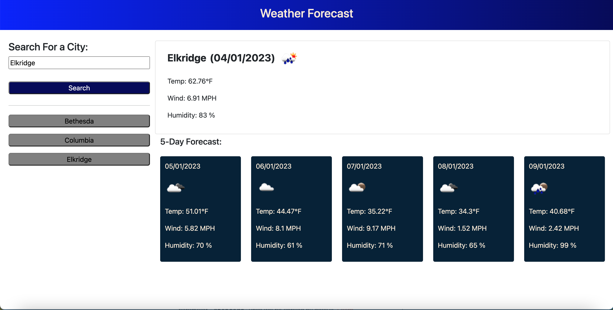

# weather-forecast

## Description 

This is an application that retrieves the current weather data for a city along with a 5-Day forecast using API calls to OpenWeatherMap API.

* Enter a city name in the input field and click on 'Search' button.
* You can then view the weather for the current day and 5-Day forecast for that city. 
* You can also view a new button with the entered city name displayed below the search button. If you click on that button then the weather data displayed will be replaced by that city's weather data. 
* Subsequent buttons will be created for all the city names entered in the search history.
* Local Storage is used for all the city names entered, and click button event is used for checking the id of the button with the locally stored cities. 

## Features

* The features are same as explained in the description, please refer above.

## Installation

N/A

## Screenshot

## Link to the deployed application

https://suvarna28.github.io/weather-forecast/ 

## Credits

* @leeclaire156 for identifying the error in my code while displaying temperature value for 5-Day forecast data. 
* Stackoverflow Website for the syntax I needed. 
* W3Schools Website for the syntax I needed. 

